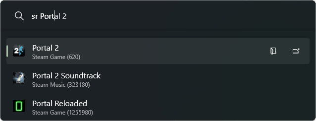

# SteamRun

A [PowerToys Run](https://aka.ms/PowerToysOverview_PowerToysRun) plugin to search and launch Steam apps.

## Screenshot



## Installation

### Manual

1. Download the [latest release](https://github.com/Artemon121/SteamRun/releases/latest) zip file
1. Extract it to `%LOCALAPPDATA%\Microsoft\PowerToys\PowerToys Run\Plugins`
1. Restart PowerToys

### Via [ptr](https://github.com/8LWXpg/ptr)

```shell
ptr add SteamRun Artemon121/SteamRun
```

## Usage

1. Open PowerToys Run (default shortcut is <kbd>Alt+Space</kbd>)
2. Type `play` followed by your search query
3. Select a search result and press `Enter` to launch

## Building

1. Clone the repository
1. Run `publish.ps1`
